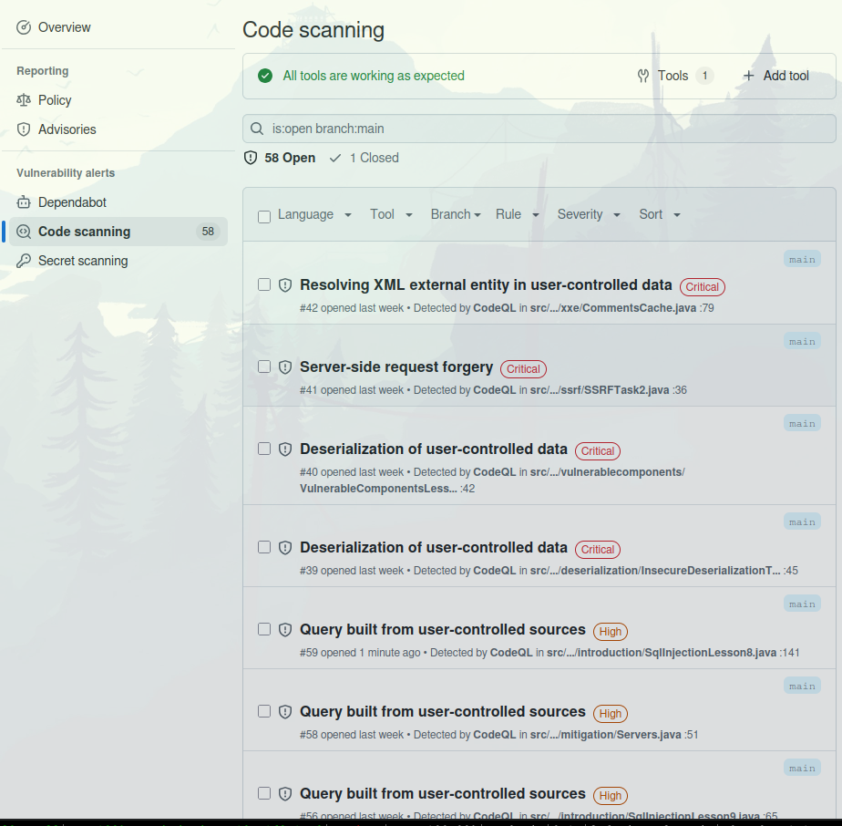
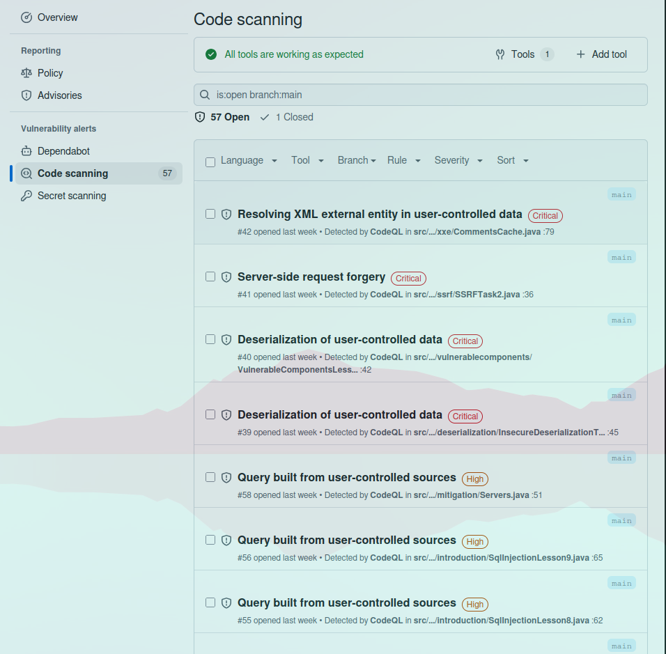
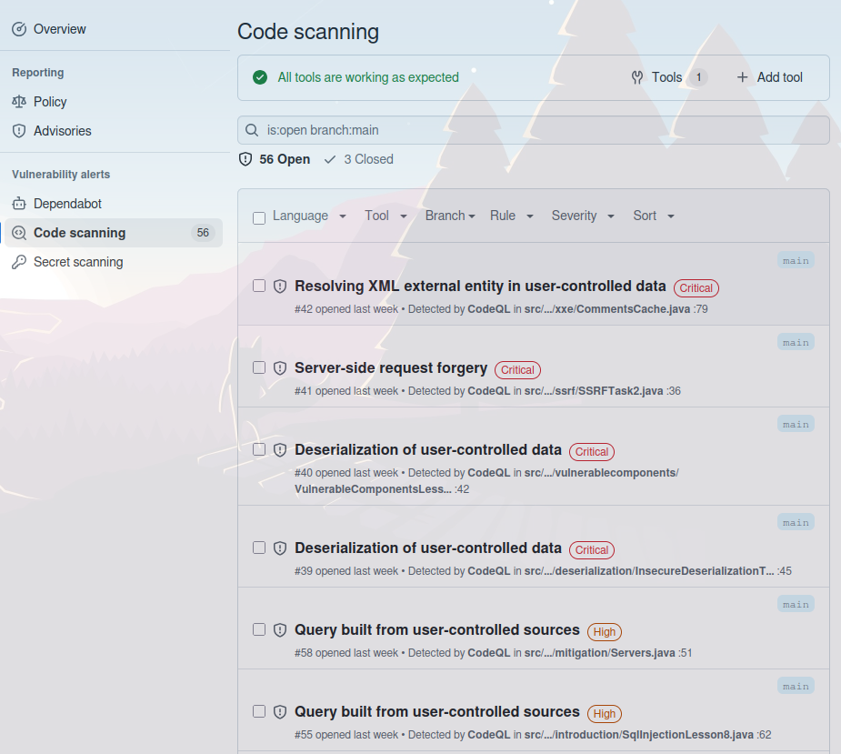

# 📄 Vulnerability Report - WebGoat

## 🔍 Εντοπισμένα Alerts

| Severity | Είδος Ευπάθειας     | Αρχείο                                                            | Περιγραφή                                      | Link στο CVE |
|----------|---------------------|-------------------------------------------------------------------|------------------------------------------------|----------------|
| Critical | [1] XXE(XML External Entity) #42     | src/main/java/org/owasp/webgoat/lessons/xxe/CommentsCache.java:79 | Resolving XML external entity in user-controlled data, an attacker could read local files and perform DoS attacks | [Alert](https://cwe.mitre.org/data/definitions/611.html)     |
| Critical | [2] Server-side request forgery  #41 | src/main/java/org/owasp/webgoat/lessons/ssrf/SSRFTask2.java:36        | Allows an attacker to make the server send HTTP requests to internal or external systems on their behalf. | [Alert](https://cwe.mitre.org/data/definitions/918.html)     |
| Critical     | [3]  Deserialization of user-controlled data  #40 | src/main/java/org/owasp/webgoat/lessons/vulnerablecomponents/VulnerableComponentsLesson.java:42 | Can execute arbitary code, elevate privilages and more through user input when its deserialized | [Alert](https://cwe.mitre.org/data/definitions/918.html   )     |
| Critical     | [4] Deserialization of user-controlled data #39 | src/main/java/org/owasp/webgoat/lessons/deserialization/InsecureDeserializationTask.java:45     | Can execute arbitary code, elevate privilages and more through user input when its deserialized | [Alert](https://cwe.mitre.org/data/definitions/502.html)     |
| High     | [5] Query built from user-controlled sources #59 | src/main/java/org/owasp/webgoat/lessons/sqlinjection/introduction/SqlInjectionLesson8.java:142        | Vulnerable to sql injection a malicious user could inject sql code into the action field     | [Alert](https://nvd.nist.gov/vuln/detail/CVE-2023-37197)     |
| High     | [6] Query built from user-controlled sources #56 | src/main/java/org/owasp/webgoat/lessons/sqlinjection/introduction/SqlInjectionLesson9.java:65          | Vulnerable to sql injection a malicious user could inject sql code into the action field     | [Alert](https://nvd.nist.gov/vuln/detail/CVE-2023-37197)     |
---

## 🛡️ Επίλυση SQL Injection

### [5] SQL Injection #59
#### Ευάλωτος Κώδικας
```
 public static void log(Connection connection, String action) {
    action = action.replace('\'', '"');
    Calendar cal = Calendar.getInstance();
    SimpleDateFormat sdf = new SimpleDateFormat("yyyy-MM-dd HH:mm:ss");
    String time = sdf.format(cal.getTime());

    String logQuery =
        "INSERT INTO access_log (time, action) VALUES ('" + time + "', '" + action + "')";

    try {
      Statement statement = connection.createStatement(TYPE_SCROLL_SENSITIVE, CONCUR_UPDATABLE);
      statement.executeUpdate(logQuery);
    } catch (SQLException e) {
      System.err.println(e.getMessage());
    }
  }
```
#### Διορθωμένος Κώδικας
```
 public static void log(Connection connection, String action) {
  
    Calendar cal = Calendar.getInstance();
    SimpleDateFormat sdf = new SimpleDateFormat("yyyy-MM-dd HH:mm:ss");
    String time = sdf.format(cal.getTime());

    String logQuery = "INSERT INTO access_log (time, action) VALUES (?, ?)";#changed

    try (PreparedStatement statement = connection.prepareStatement(logQuery)) {#changed
        statement.setString(1, time);
        statement.setString(2, action);
        statement.executeUpdate();
    } catch (SQLException e) {
      System.err.println(e.getMessage());
    }
  }
```
### [6] SQL Injection #56
#### Ευάλωτος Κώδικας
```
protected AttackResult injectableQueryIntegrity(String name, String auth_tan) {
    StringBuilder output = new StringBuilder();
    String queryInjection =
        "SELECT * FROM employees WHERE last_name = '"
            + name
            + "' AND auth_tan = '"
            + auth_tan
            + "'";
    try (Connection connection = dataSource.getConnection()) {
      // V2019_09_26_7__employees.sql
      int oldMaxSalary = this.getMaxSalary(connection);
      int oldSumSalariesOfOtherEmployees = this.getSumSalariesOfOtherEmployees(connection);
      // begin transaction
      connection.setAutoCommit(false);
      // do injectable query
      Statement statement = connection.createStatement(TYPE_SCROLL_SENSITIVE, CONCUR_UPDATABLE);
      SqlInjectionLesson8.log(connection, queryInjection);
      statement.execute(queryInjection);
      // check new sum of salaries other employees and new salaries of John
      int newJohnSalary = this.getJohnSalary(connection);
      int newSumSalariesOfOtherEmployees = this.getSumSalariesOfOtherEmployees(connection);
      if (newJohnSalary > oldMaxSalary
          && newSumSalariesOfOtherEmployees == oldSumSalariesOfOtherEmployees) {
        // success commit
        connection.commit(); // need execute not executeQuery
        connection.setAutoCommit(true);
        output.append(
            SqlInjectionLesson8.generateTable(this.getEmployeesDataOrderBySalaryDesc(connection)));
        return success(this).feedback("sql-injection.9.success").output(output.toString()).build();
      }
      ... continues
```
#### Διορθωμένος Κώδικας
```
 protected AttackResult injectableQueryIntegrity(String name, String auth_tan) {
    StringBuilder output = new StringBuilder();
    String queryInjection = "SELECT * FROM employees WHERE last_name = ? AND auth_tan = ?";#changed

    try (Connection connection = dataSource.getConnection()) {
      // V2019_09_26_7__employees.sql
      int oldMaxSalary = this.getMaxSalary(connection);
      int oldSumSalariesOfOtherEmployees = this.getSumSalariesOfOtherEmployees(connection);
      // begin transaction
      connection.setAutoCommit(false);
      // do injectable query
      PreparedStatement statement = connection.prepareStatement(queryInjection);#changed
      statement.setString(1, name);
      statement.setString(2, auth_tan);
      SqlInjectionLesson8.log(connection, queryInjection);
      statement.execute(queryInjection);
      // check new sum of salaries other employees and new salaries of John
      int newJohnSalary = this.getJohnSalary(connection);
      int newSumSalariesOfOtherEmployees = this.getSumSalariesOfOtherEmployees(connection);
      if (newJohnSalary > oldMaxSalary
          && newSumSalariesOfOtherEmployees == oldSumSalariesOfOtherEmployees) {
        // success commit
        connection.commit(); // need execute not executeQuery
        connection.setAutoCommit(true);
        output.append(
            SqlInjectionLesson8.generateTable(this.getEmployeesDataOrderBySalaryDesc(connection)));
        return success(this).feedback("sql-injection.9.success").output(output.toString()).build();
      }
      ... continues
```
---

## 🔁 Κατάσταση μετά τη Διόρθωση

| Ευπάθεια | Κατάσταση | Σχόλιο |
|----------|-----------|--------|
| [5] SQL Injection #57| ✅ Fixed | Έγινε χρήση PreparedStatement. |
| [6] SQL Injection #56| ✅ Fixed | Έγινε χρήση PreparedStatement. |


---
## ScreenShots μετά την Διόρθωση
### Αποτελέσματα Code Scanning Χωρίς Διορθώσεις

### Διωρθωμένο SQL Injection #57

### Διωρθωμένο SQL Injection #56
